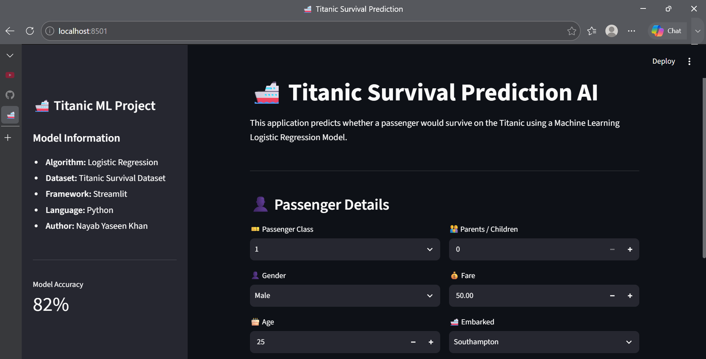
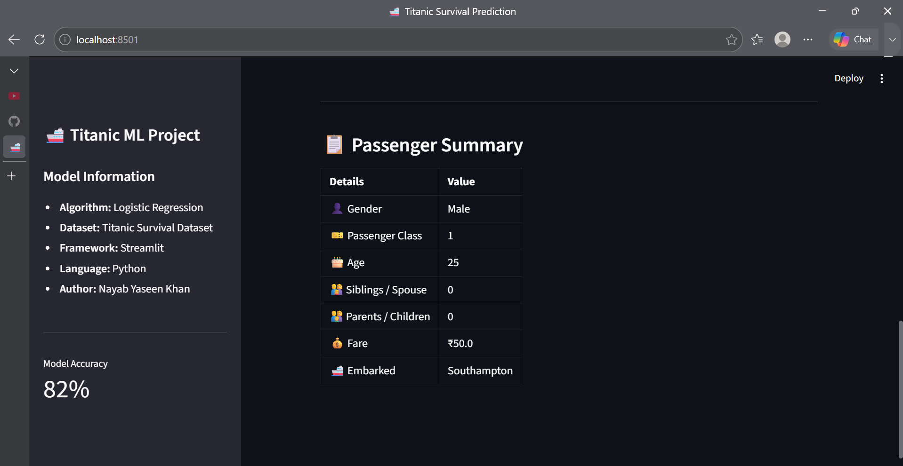
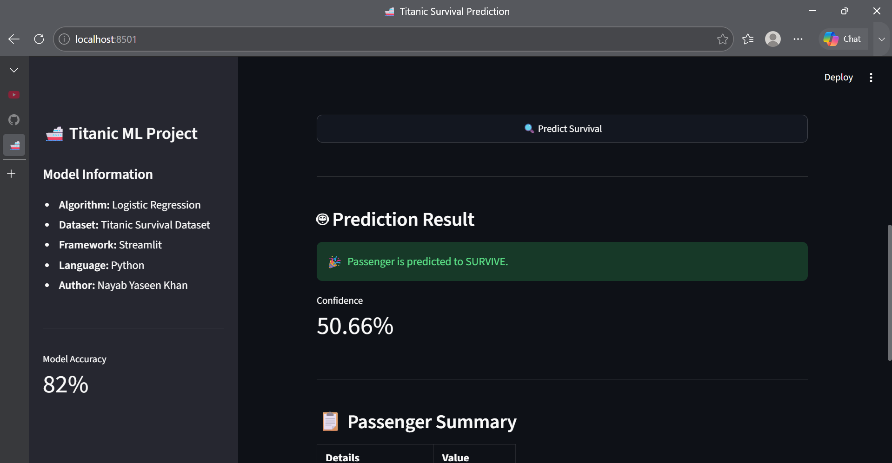

# 🚢 Titanic Survival Prediction System

A Machine Learning web application that predicts whether a passenger would survive the Titanic disaster using Logistic Regression and Streamlit.

---

## 📌 Project Overview

This project demonstrates the complete Machine Learning workflow:

- Data Cleaning
- Exploratory Data Analysis (EDA)
- Feature Engineering
- Model Training
- Model Evaluation
- Model Saving
- Streamlit Web Application

---

## 🚀 Features

- Predict passenger survival
- Interactive Streamlit interface
- Logistic Regression model
- Real-time prediction
- Prediction confidence
- Modular project structure

---

## 🛠️ Technology Stack

- Python
- Pandas
- NumPy
- Scikit-Learn
- Streamlit
- Joblib
- Matplotlib

---

## 📂 Project Structure

```text
Predictive-Data-Engine
│
├── data
├── models
├── notebooks
├── screenshots
├── assets
├── venv
├── .gitignore
├── app.py
├── predict.py
├── README.md
├── requirements.txt
└── train.py

---

## ⚙️ Installation

Clone the repository:

```bash
git clone https://github.com/nayabyaseenkhan/Predictive-Data-Engine.git
```

Move into the project:

```bash
cd Predictive-Data-Engine
```

Install dependencies:

```bash
pip install -r requirements.txt
```

Run the application:

```bash
streamlit run app.py
```

---

## 🤖 Machine Learning Model

Algorithm Used:

- Logistic Regression

Features:

- Passenger Class
- Gender
- Age
- Siblings/Spouse
- Parents/Children
- Fare
- Embarked

Target:

- Survived

---

## 📊 Results

The model predicts whether a passenger survived based on the provided input features and displays the prediction through an interactive Streamlit interface.

---

## 📸 Application Screenshots

### Home Page



---

### Prediction



---

### Result



---

## 🔮 Future Improvements

- Random Forest Classifier
- XGBoost
- Model Comparison
- Hyperparameter Tuning
- Deployment on Streamlit Community Cloud

---

## 👨‍💻 Author

**Nayab Yaseen Khan**

GitHub:
https://github.com/nayabyaseenkhan